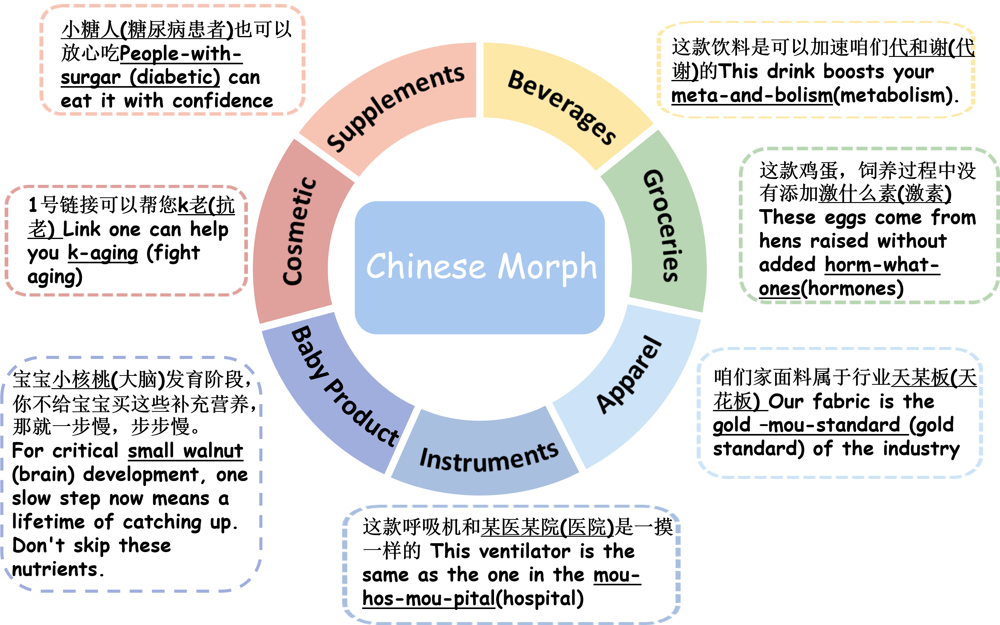

<!-- # :page_with_curl: Chinese Live-Streaming E-Commerce Morph Resolution: Datasets and Methods 
<p align="center">
    <a href="https://github.com/OpenBMB/AgentVerse/blob/main/LICENSE">
        
    </a>
    <a href="https://www.python.org/downloads/release/python-3916/">
        
    </a>
    <a href="https://github.com/OpenBMB/AgentVerse/actions/">
        
    </a>
    <a href="https://github.com/psf/black">
        

      <a href="https://huggingface.co/AgentVerse">
        
    </a>
    <a href="https://discord.gg/gDAXfjMw">
        
    </a>
  
    
</p> -->
<!-- ---
## Data Annotate Website 💻

The annotation website we use consists of a front-end (Vue) and a back-end (Flask), which can be found at labelwebsite.
We provide a short video to demonstrate the specific annotation process.
Please note that the annotators have already been trained. -->

<h1 align="center"> 📣 Chinese Live-Streaming E-Commerce Morph Resolution: Datasets and Methods</h1>

<p align="center">
    <a href="https://github.com/OpenBMB/AgentVerse/blob/main/LICENSE">
        
    </a>
    <a href="https://www.python.org/downloads/release/python-3916/">
        
    </a>
    <a href="https://github.com/OpenBMB/AgentVerse/actions/">
        
    </a>
    <a href="https://github.com/psf/black">
            
</p>


<!-- <p align="center">

</p> -->

---

**This is repository for the Chinese Live-Streaming E-Commerce Morph Resolution: Datasets and Methods.**


<p align="center">

</p>


---


# 📰 What's New

- [2025/8/3] 🚀 We reannotate health AMR and extend AMR dataset to general domain.   Proposed JointMER and CDRF, two state-of-the-art morph resolution methods!

- [2025/3/1] 🚀 [Chinese Morph Resolution in E-commerce Live Streaming Scenarios](https://aclanthology.org/2025.naacl-industry.32.pdf) was accepted by NAACL Industry Track!


# Contents
- [📰 What's New](#-whats-new)
- [Contents](#contents)
- [🚀 Getting Started](#-getting-started)
  - [Annotation Website](#webiste)
  - [Health and General AMR](#environment-variables)
  - [Methods](#simulation)
    - [environment prepare](#framework-required-modules)
    - [model checkpoint](#cli-example)
    - [suage](#gui-example)
  
- [Contact](#contact)


# Data Annotate Website 💻

## Video example 💻

The annotation website we use consists of a front-end (Vue) and a back-end (Flask), which can be found at labelwebsite. We provide a short video to demonstrate the specific annotation process.
**Please note that the annotators have already been trained.**

<video width="100%" height="auto" controls>
  <source src="./assets/data_annotate.mp4" type="video/mp4">
  Your browser does not support the video tag.
</video>


If you want to use AgentVerse with local models such as LLaMA, you need to additionally install some other dependencies:
```bash
pip install -r requirements_local.txt
```

**Install with pip**

Or you can install through pip
```bash
pip install -U agentverse
```


# 🚀 Getting Started

## Installation


**Manually Install (Recommended!)**

**Make sure you have Python >= 3.9**
```bash
git clone https://github.com/OpenBMB/AgentVerse.git --depth 1
cd AgentVerse
pip install -e .
```

If you want to use AgentVerse with local models such as LLaMA, you need to additionally install some other dependencies:
```bash
pip install -r requirements_local.txt
```

**Install with pip**

Or you can install through pip
```bash
pip install -U agentverse
```

## Environment Variables
You need to export your OpenAI API key as follows：
```bash
# Export your OpenAI API key
export OPENAI_API_KEY="your_api_key_here"
```

If you want use Azure OpenAI services, please export your Azure OpenAI key and OpenAI API base as follows：
```bash
export AZURE_OPENAI_API_KEY="your_api_key_here"
export AZURE_OPENAI_API_BASE="your_api_base_here"
```

## Simulation

### Framework Required Modules 
```
- agentverse 
  - agents
    - simulation_agent
  - environments
    - simulation_env
```

### CLI Example

You can create a multi-agent environments provided by us. Using the classroom scenario as an example. In this scenario, there are nine agents, one playing the role of a professor and the other eight as students.

```shell
agentverse-simulation --task simulation/nlp_classroom_9players
```

### GUI Example

We also provide a local website demo for this environment. You can launch it with

```shell
agentverse-simulation-gui --task simulation/nlp_classroom_9players
```
After successfully launching the local server, you can visit [http://127.0.0.1:7860/](http://127.0.0.1:7860/) to view the classroom environment.

If you want to run the simulation cases with tools (e.g., simulation/nlp_classroom_3players_withtool), you need to install BMTools as follows:
```bash
git clone git+https://github.com/OpenBMB/BMTools.git
cd BMTools
pip install -r requirements.txt
python setup.py develop
```
This is optional. If you do not install BMTools, the simulation cases without tools can still run normally.

## Task-Solving 


### Framework Required Modules 
```
- agentverse 
  - agents
    - simulation_env
  - environments
    - tasksolving_env
```

### CLI Example

To run the experiments with the task-solving environment proposed in our [paper](https://arxiv.org/abs/2308.10848), you can use the following command:

To run AgentVerse on a benchmark dataset, you can try
```shell
# Run the Humaneval benchmark using gpt-3.5-turbo (config file `agentverse/tasks/tasksolving/humaneval/gpt-3.5/config.yaml`)
agentverse-benchmark --task tasksolving/humaneval/gpt-3.5 --dataset_path data/humaneval/test.jsonl --overwrite
```

To run AgentVerse on a specific problem, you can try
```shell
# Run a single query (config file `agentverse/tasks/tasksolving/brainstorming/gpt-3.5/config.yaml`). The task is specified in the config file.
agentverse-tasksolving --task tasksolving/brainstorming
```

To run the tool using cases presented in our paper, i.e., multi-agent using tools such as web browser, Jupyter notebook, bing search, etc., you can first build ToolsServer provided by [XAgent](https://github.com/OpenBMB/XAgent). You can follow their [instruction](https://github.com/OpenBMB/XAgent#%EF%B8%8F-build-and-setup-toolserver) to build and run the ToolServer.

After building and launching the ToolServer, you can use the following command to run the task-solving cases with tools:
```shell
agentverse-tasksolving --task tasksolving/tool_using/24point
```
We have provided more tasks in `agentverse/tasks/tasksolving/tool_using/` that show how multi-agent can use tools to solve problems.

Also, you can take a look at `agentverse/tasks/tasksolving` for more experiments we have done in our paper.

## Local Model Support
## vLLM Support
If you want to use vLLM, follow the guide [here](https://docs.vllm.ai/en/latest/getting_started/quickstart.html) to install and setup the vLLM server which is used to handle larger inference workloads. Create the following environment variables to connect to the vLLM server:
```bash
export VLLM_API_KEY="your_api_key_here"
export VLLM_API_BASE="http://your_vllm_url_here"
```

Then modify the `model` in the task config file so that it matches the model name in the vLLM server. For example:
```yaml
model_type: vllm
model: llama-2-7b-chat-hf
```

## FSChat Support
This section provides a step-by-step guide to integrate FSChat into AgentVerse. FSChat is a framework that supports local models such as LLaMA, Vicunna, etc. running on your local machine.
### 1. Install the Additional Dependencies
If you want to use local models such as LLaMA, you need to additionally install some other dependencies:
```bash
pip install -r requirements_local.txt
```

### 2. Launch the Local Server
Then modify the `MODEL_PATH` and `MODEL_NAME` according to your need to launch the local server with the following command:
```bash
bash scripts/run_local_model_server.sh
```
The script will launch a service for Llama 7B chat model.
The `MODEL_NAME` in AgentVerse currently supports several models including `llama-2-7b-chat-hf`, `llama-2-13b-chat-hf`, `llama-2-70b-chat-hf`, `vicuna-7b-v1.5`, and `vicuna-13b-v1.5`. If you wish to integrate additional models that are [compatible with FastChat](https://github.com/lm-sys/FastChat/blob/main/docs/model_support.md), you need to:
1. Add the new `MODEL_NAME` into the `LOCAL_LLMS` within `agentverse/llms/__init__.py`. Furthermore, establish
2. Add the mapping from the new `MODEL_NAME` to its corresponding Huggingface identifier in the `LOCAL_LLMS_MAPPING` within the `agentverse/llms/__init__.py` file.

### 3. Modify the Config File
In your config file, set the `llm_type` to `local` and `model` to the `MODEL_NAME`. For example
```yaml
llm:
  llm_type: local
  model: llama-2-7b-chat-hf
  ...
```

You can refer to `agentverse/tasks/tasksolving/commongen/llama-2-7b-chat-hf/config.yaml` for a more detailed example.

# AgentVerse Showcases

## Simulation Showcases
Refer to [simulation showcases](README_simulation_cases.md)

## Task-Solving Showcases
Refer to [tasksolving showcases](README_tasksolving_cases.md)


# 🌟 Join Us!
AgentVerse is on a mission to revolutionize the multi-agent environment for large language models, and we're eagerly looking for passionate collaborators to join us on this exciting journey.


# Contact

Project Creation: zjh2001@qq.com

